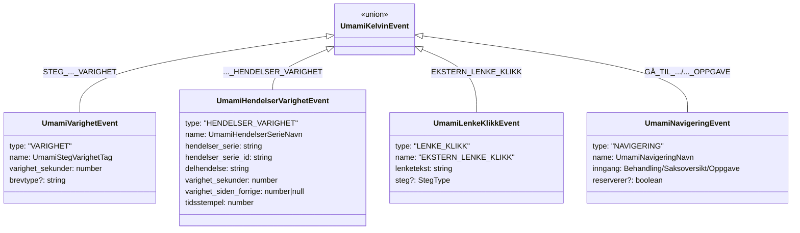

# Umami-hendelsestyper i denne kodebasen

`UmamiKelvinEvent` (`lib/utils/umami/kelvinEvent.ts`) er en diskriminert union på `type`-feltet med fire varianter, hver definert i sin egen fil under `lib/utils/umami/`.

- **`UmamiVarighetEvent`** (`varighet.ts`) — tidsmåling for et behandlingssteg, tag `STEG_<KONTEKST>_VARIGHET`.
- **`UmamiHendelserVarighetEvent`** (`hendelserVarighet.ts`) — serie av tidsmålte delhendelser, tag `<KONTEKST>_HENDELSER_VARIGHET`.
- **`UmamiLenkeKlikkEvent`** (`lenkeKlikk.ts`) — klikk på ekstern lenke, tag `EKSTERN_LENKE_KLIKK`.
- **`UmamiNavigeringEvent`** (`navigering.ts`) — navigasjon/oppgavehandling, tag `GÅ_TIL_<MÅL>` eller `<HANDLING>_OPPGAVE`.

Alle sendes via `clientLoggUmamiEvent` (`client.ts`) → `POST /api/umami` (`app/api/umami/route.ts`) → `@umami/node`.
